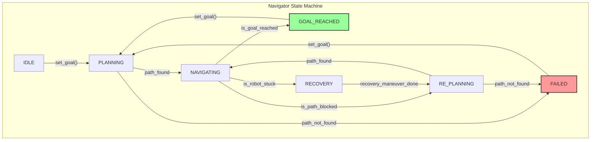

## 1. System Overview

This document outlines the architecture of the hybrid navigation system. The system's primary goal is to combine the long-range, heuristic-driven planning of a **DNN-PRM Global Planner** with the real-time, kinematically-aware obstacle avoidance of a **Dynamic Window Approach (DWA) Local Planner**.

The core of the system is a **Navigator** class, which acts as a state-driven controller, managing the flow of information and decision-making between these two planning layers.

---

## 2. Component Data Flow ("The Contract")

This section defines the inputs and outputs (the "contract") for each major component.

*(Image description: A diagram showing the Navigator in the center. An arrow from the Navigator labeled "Global Goal" points to the Global Planner. An arrow from the Global Planner labeled "Waypoint Path" points back to the Navigator. An arrow from the Navigator labeled "Local Goal" points to the Local Planner. An arrow from the Local Planner labeled "Velocity Command" points back to the Navigator. A final arrow from the Navigator labeled "Final Velocity Command" points outwards to the Robot.)*

| Component | Inputs | Outputs |
| :--- | :--- | :--- |
| **Global Planner** (`DNNPRMPlanner`) | • `start_pose`: Robot's current position/orientation. • `goal_pose`: Final destination. • `static_map`: The global obstacle grid. • `robot_params`: Clearance, step size, etc. | • `global_path`: A `List[Tuple[x, y]]` of waypoints, or `None` if planning fails. |
| **Path Follower** | • `current_pose`: Robot's current position/orientation. • `global_path`: The current waypoint path. | • `local_goal`: A single `Tuple[x, y]` point on the path ahead of the robot. |
| **Local Planner** (`DynamicWindowPlanner`) | • `current_state`: Robot's full state (pose, velocities). • `local_goal`: The target point from the Path Follower. • `local_map`: A small, local costmap from sensors. | • `velocity_command`: A `Tuple[v, omega]` command, or `None` if no safe trajectory is found. |
| **Navigator** (`Navigator`) | • A final `goal_pose` to achieve. | • A final `velocity_command` to send to the robot's controllers. |

---

## 3. Navigator State Machine

The `Navigator` operates as a finite state machine. The current state dictates its behavior on each `tick()` or update cycle.

### States

*   `IDLE`: The system is initialized but has not received a goal. It outputs a zero-velocity command.
*   `PLANNING`: The system has a goal and is actively querying the Global Planner for a path. This is a transient state.
*   `NAVIGATING`: The system has a valid global path and is actively using the Path Follower and Local Planner to execute it.
*   `RE_PLANNING`: The current global path has been invalidated (e.g., it is blocked by a new obstacle). The system must compute a new global path.
*   `RECOVERY`: The Local Planner is completely stuck and cannot find any safe local trajectory. The system will execute a pre-defined maneuver (e.g., rotate) before attempting to re-plan.
*   `GOAL_REACHED`: The robot is within a specified tolerance of the final goal. The task is complete.
*   `FAILED`: The Global Planner failed to find a path, or a recovery maneuver was unsuccessful. The task has failed.

### State Transition Diagram

### Transition Trigger Conditions (The "Logic")

This is the core logic that the `Navigator` will implement on each `tick()`.

*   **`is_goal_reached`:** `distance(current_pose, final_goal) < goal_tolerance`.
*   **`is_path_blocked`:** The `PathFollower` reports that the path segment ahead is obstructed according to the current local sensor data.
*   **`is_robot_stuck`:** The `DynamicWindowPlanner` returns `None` for its velocity command, indicating no safe trajectory could be found.
*   **`recovery_maneuver_done`:** The pre-defined recovery action (e.g., a 360-degree rotation or a short backward movement) has been completed.

---

This design provides a robust framework for handling the complex interactions between the different planning layers. It defines clear states, responsibilities, and failure-handling procedures, which will guide a clean and effective implementation.
